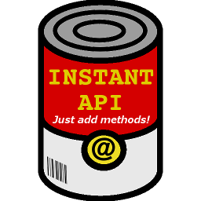
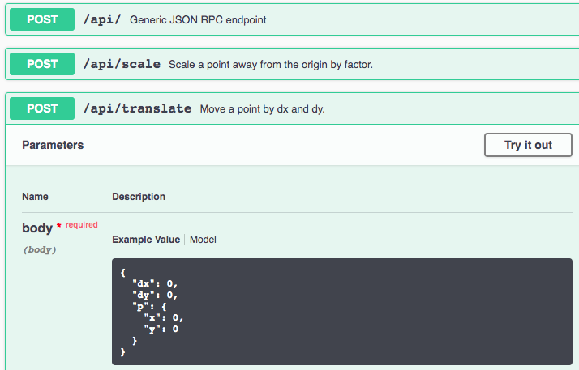

<p align="center">
  
</p>

<p align="center">
    <a href="https://travis-ci.org/alexmojaki/instant_api"></a>
    <a href="https://coveralls.io/github/alexmojaki/instant_api?branch=master"></a>
    <a href="https://pypi.python.org/pypi/instant_api"></a>
    
# instant_api

Instantly create an HTTP API with automatic type conversions, JSON RPC, and a Swagger UI. All the boring stuff is done for you, so you can focus on the interesting logic while having an awesome API. Just add methods!

  * [Installation](#installation)
  * [Basic usage](#basic-usage)
     * [Talking to the API with instant_client](#talking-to-the-api-with-instant_client)
  * [Using method paths instead of JSON-RPC](#using-method-paths-instead-of-json-rpc)
     * [HTTP status codes](#http-status-codes)
  * [Global API configuration](#global-api-configuration)
  * [Handling errors](#handling-errors)
  * [Attaching methods](#attaching-methods)
     * [Customising method paths in the Swagger UI](#customising-method-paths-in-the-swagger-ui)
        * [Setting attributes directly](#setting-attributes-directly)
        * [Setting summary and description via the docstring](#setting-summary-and-description-via-the-docstring)
  * [Customising global request and method handling](#customising-global-request-and-method-handling)
  * [Authentication](#authentication)
  * [Dependencies](#dependencies)

## Installation

    pip install instant-api

Or to also install the corresponding Python client:

    pip install 'instant-api[client]'

## Basic usage

Just write some Python functions or methods and decorate them. Parameters and the return value need type annotations so that they can be converted to and from JSON for you. You can use dataclasses for complex values.

```python
from dataclasses import dataclass
from flask import Flask
from instant_api import InstantAPI

app = Flask(__name__)

@dataclass
class Point:
    x: int
    y: int

@InstantAPI(app)
class Methods:
    def translate(self, p: Point, dx: int, dy: int) -> Point:
        """Move a point by dx and dy."""
        return Point(p.x + dx, p.y + dy)

    def scale(self, p: Point, factor: int) -> Point:
        """Scale a point away from the origin by factor."""
        return Point(p.x * factor, p.y * factor)

if __name__ == '__main__':
    app.run()
```

Visit http://127.0.0.1:5000/apidocs/ for a complete Swagger GUI to try out the API interactively:



### Talking to the API with `instant_client`

If you need a Python client, I highly recommend the companion library [instant_client](https://github.com/alexmojaki/instant_client). It handles data conversion on the client side and works well with developer tools. Basic usage looks like:

```python
from server import Methods, Point  # the classes we defined above
from instant_client import InstantClient

# The type hint is a lie, but your linter/IDE doesn't know that!
methods: Methods = InstantClient("http://127.0.0.1:5000/api/", Methods()).methods

assert methods.scale(Point(1, 2), factor=3) == Point(3, 6)
```

That looks a lot like it just called `Methods.scale()` directly, which is the point (no pun intended), but under the hood it did in fact send an HTTP request to the server.

## Using method paths instead of JSON-RPC

The API is automatically available in two flavours, and clients can choose which way they prefer to communicate:

1. The central JSON-RPC endpoint, which follows the JSON-RPC protocol spec exactly, and is easiest to use with standard client libraries.
2. Method paths, which make it slightly easier for humans to write requests manually (especially in the Swagger GUI) and use the features of HTTP more.

To make a request to a method path, include the method name at the end of the URL, and just send the parameters object in the JSON body. Here's what such a call looks like:

```python
import requests

response = requests.post(
    'http://127.0.0.1:5000/api/scale',
    json={
        'p': {'x': 1, 'y': 2}, 
        'factor': 3,
    },
)

assert response.json()['result'] == {'x': 3, 'y': 6}
```

The response will be a complete JSON-RPC response as if you had made a full JSON-RPC request. In particular it will either have a `result` or an `error` key.

### HTTP status codes

The central JSON-RPC endpoint will always (unless a request is not authenticated, [see below](#authentication)) return the code HTTP status code 200 (OK), even if there's an error, as standard clients expect that.

Since the method paths are not quite JSON-RPC, they may return a different code in case of errors. In particular an invalid request will lead to a 400 and an unhandled error inside a method will cause a 500.

If you [raise an `InstantError`](#handling-errors) inside a method, you can give it an `http_code`, e.g. `raise InstantError(..., http_code=404)`. This will become the HTTP status code *only if the method was called by the method path, not the JSON-RPC endpoint*.

## Global API configuration

The `InstantAPI` class requires a Flask app and has the following optional keyword-only parameters:

- `path` is a string (default `'/api/'`) which is the endpoint that will be added to the app for the JSON RPC. There will also be a path for each method based on the function name, e.g. `/api/scale` and `/api/translate` - see [Using method paths instead of JSON-RPC](#using-method-paths-instead-of-json-rpc). Specify a different string to change all of these paths.
- `swagger_kwargs` is a dictionary (default empty) of keyword arguments to pass to the `flasgger.Swagger` constructor that is called with the app. For example, you can customise the Swagger UI by [passing a dictionary to `config`](https://github.com/flasgger/flasgger#customize-default-configurations):

```python
api = InstantAPI(app, swagger_kwargs={"config": {"specs_route": "/my_apidocs/", ...}})
```

## Handling errors

When the server encounters an error, the response will contain an `error` key (instead of a `result`) with an object containing `code`, `data`, and `message`. For example, if a method is given invalid parameters, the details of the error (either a `TypeError` or a marshmallow `ValidationError`) will be included in the response. The error code will be `-32602`. The response JSON looks like this:

```json
{
  "error": {
    "code": -32602,
    "data": {
      "p": {
        "y": [
          "Not a valid integer."
        ]
      }
    },
    "message": "marshmallow.exceptions.ValidationError: {'p': {'y': ['Not a valid integer.']}}"
  },
  "id": 0,
  "jsonrpc": "2.0"
}
```

You can find more details, including the standard error codes for some typical errors, in the [JSON-RPC protocol spec](https://www.jsonrpc.org/specification#error_object).

To return your own custom error information, raise an `InstantError` in your method, e.g:

```python
from instant_api import InstantAPI, InstantError

@InstantAPI(app)
class Methods:
    def find_thing(self, thing_id: int) -> Thing:
        ...
        raise InstantError(
            code=123,
            message="Thing not found anywhere at all",
            data=["not here", "or here"],
        )
```

The response will then be:

```json
{
  "error": {
    "code": 123,
    "data": [
      "not here",
      "or here"
    ],
    "message": "Thing not found anywhere at all"
  },
  "id": 0,
  "jsonrpc": "2.0"
}
```

The HTTP status code depends on which flavour of the API you use - see [this section](#http-status-codes).

## Attaching methods

Instances of `InstantAPI` can be called with functions, classes, or arbitrary objects to add methods to the API. For functions and classes, the instance can be used as a decorator to call it.

Decorating a single function adds it as an API method, as you'd expect. The function itself should not be a method of a class, since there is no way to provide the first argument `self`.

Calling `InstantAPI` with an object will search through all its attributes and add to the API all functions (including bound methods) whose name doesn't start with an underscore (`_`).

Decorating a class will construct an instance of the class without arguments and then call the resulting object as described above. This means it will add bound methods, so the `self` argument is ignored.

So given `api = InstantAPI(app)`, all of these are equivalent:

```python
@api
def foo(bar: Bar) -> Spam:
    ...

api(foo)

@api
class Methods:
    def foo(self, bar: Bar) -> Spam:
        ...

api(Methods)

api(Methods())
```

If a function is missing a type annotation for any of its parameters or for the return value, an exception will be raised. If you don't want a method to be added to the API, prefix its name with an underscore, e.g. `def _foo(...)`.

### Customising method paths in the Swagger UI

#### Setting attributes directly

For each method, a [`flasgger.SwaggerView`](https://github.com/flasgger/flasgger#using-marshmallow-schemas) will be created.
You can customise the view by passing a dictionary of class attributes
in the argument `swagger_view_attrs` of the decorator.
For example:

```python
@api(swagger_view_attrs={"tags": ["Stuff"]})
def foo(...)
```

This will put `foo` in the `Stuff` section of the Swagger UI.

Note that the below is invalid syntax [before Python 3.9](https://www.python.org/dev/peps/pep-0614/):

```python
@InstantAPI(app)(swagger_view_attrs={"tags": ["Stuff"]})
def foo(...)
```

#### Setting summary and description via the docstring

If a method has a docstring, its first line will be the `summary`
in the OpenAPI spec of the method path, visible in the overview in the Swagger UI.
The remaining lines will become the `description`,
visible when the path is expanded in the UI.

## Customising global request and method handling

To directly control how requests are handled, create a subclass of `InstantAPI` and override one of these methods:

- `handle_request(self, method)` is the entrypoint which converts a raw flask request to a response. If `method` is None, the request was made to the generic JSON-RPC path. Otherwise `method` is a string with the method name at the end of the request path.
- `call_method(self, func, *args, **kwargs)` calls the API method `func` with the given arguments. The arguments here are not yet deserialized according to the function type annotations.

Unless you're doing something very weird, remember to call the parent method with `super()` somewhere.

## Authentication

To require authentication for requests:

1. Create a subclass of `InstantAPI`.
2. Override the method `def is_authenticated(self):`.
3. Return a boolean: `True` if a user should have access (based on the global Flask `request` object), `False` if they should be denied.
4. Use an instance of your subclass to decorate methods.

Unauthenticated requests will receive a 403 response with a non-JSON body.

## Dependencies

- [**`datafunctions`**](https://github.com/alexmojaki/datafunctions) (which in turn uses [`marshmallow`](https://marshmallow.readthedocs.io/)) is used by both `instant_api` and `instant_client` to transparently handle conversion between JSON and Python classes on both ends.
- [**Flasgger**](https://github.com/flasgger/flasgger) provides the Swagger UI.
- [**`json-rpc`**](https://github.com/pavlov99/json-rpc) handles the protocol.

Because other libraries do so much of the work, `instant_api` itself is a very small library, essentially contained in [one little file](https://github.com/alexmojaki/instant_api/blob/master/instant_api/instant_api.py). You can probably read the source code pretty easily and adapt it to your needs.
